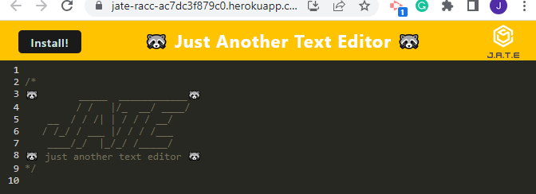
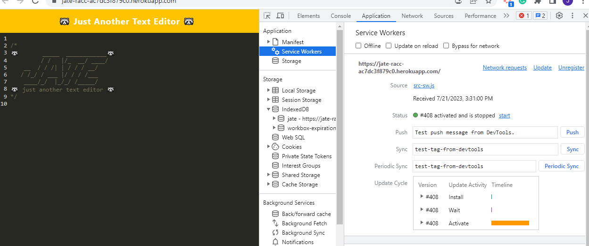
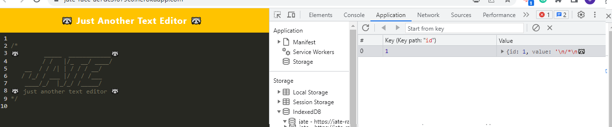
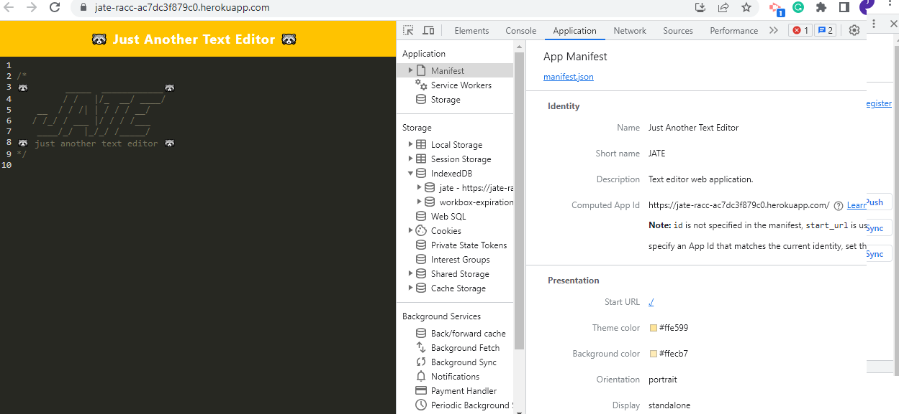
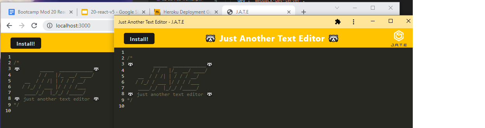

# JATE Racc 

## Description 
Just Another Text Editor Racc 🦝 is a text editor that you can install for online or offline usage! The service worker allows you to use it offline, meanwhile the notes you take are stored in an IndexedDB(and local storage), so you can access them even if you don’t have internet connection!  

## Deployment
Heroku: [JATEracc](https://jate-racc-ac7dc3f879c0.herokuapp.com/)  
GitHub repo: [JATE-Racc-noter](https://github.com/jaychan0125/J.A.T.E-Racc-noter)

## Table of Contents 
- [Installation](#installation)
- [Usage](#usage)
- [Contributors](#contributors)
- [License](#license)

## Installation
Here we've used concurrently to run the client and server folders together, and we've also used exress, nodemon, iddb, webpack (and a host of its dependencies) to make it work like the css loader, and babble.

## Usage

If you use the deployed [heroku link](https://jate-racc-ac7dc3f879c0.herokuapp.com/) it will take you here to the starting page, where you'll see the header. 
  

You can see the service worker loaded in: 
  

You can also see the data that is saved in the IndexedDB:
  

You can see the manifest for the application: 
  

And you can also install it so you have the application too:
  

## Contributors
[jaychan0125](https://github.com/jaychan0125)

## License
Licensed under the [MIT License](https://opensource.org/licenses/MIT)

